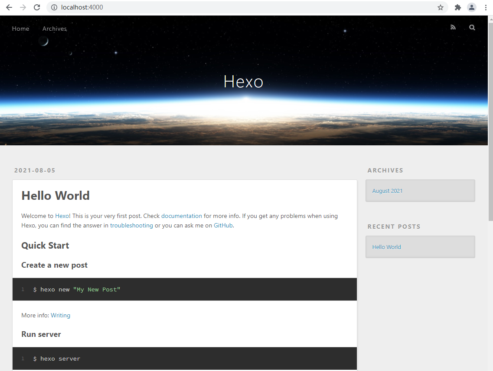

# 致谢
    感谢韦阳
	韦阳博客地址 https://godweiyang.com
	使用教程 https://godweiyang.com/2018/04/13/hexo-blog/
			https://blog.csdn.net/God_WeiYang/article/details/99193359
    
	感谢张攀钦
	张攀钦博客地址 http://mflyyou.cn
	使用教程 https://blog.csdn.net/Wanguyunxiaodaniu/article/details/104716776
	
# 注意
    本项目最重要的文件是 scaffolds、source、themes
    而 public 是运行 hexo g 命令后自动产生的


# hexo史上最全搭建教程
[hexo史上最全搭建教程](https://blog.csdn.net/sinat_37781304/article/details/82729029)
[hexo+github搭建博客(超级详细版，精细入微)](https://blog.csdn.net/victoryxa/article/details/103733655)
[超详细Hexo+Github博客搭建小白教程](https://blog.csdn.net/God_WeiYang/article/details/99193359)

# Hexo简介
    Hexo是一款基于Node.js的静态博客框架，依赖少易于安装使用，可以方便的生成静态网页托管在GitHub和Coding上，是搭建博客的首选框架。
[hexo官网](https://hexo.io/zh-cn/)

    hexo 会解析 markdown 语法 生成对应的 html ，主题就是 css 样式。
    hexo GitHub 克隆之后 yarn install 安装依赖。hexo s 本地预览效果。
    如果是用npm安装的依赖包的话，请将 yarn.lock 先删除，再 npm install 安装。我已在项目下 .npmrc 配置依赖包从淘宝镜像下载。
    root 为项目根路径。

# 本地预览
hexo s

# 根据配置文件和主题，将 root/source/_post 下的 markdown 文件生成 html 内容
hexo g

# 清空 hexo g 生成的内容，内容在 root/public
hexo clean

# 将本地生成 url 链接推送到百度，让百度爬取其中的内容进行索引
hexo d

# 根据 标题名称  在root/source/_post 生成 markdown 文件
hexo new post 标题名称


## 教程分三个部分，
    第一部分：hexo的初级搭建还有部署到github page上，以及个人域名的绑定。
    第二部分：hexo的基本配置，更换主题，实现多终端工作，以及在coding page部署实现国内外分流
    第三部分：hexo添加各种功能，包括搜索的SEO，阅读量统计，访问量统计和评论系统等。

# 第一部分
    hexo的初级搭建还有部署到github page上，以及个人域名的绑定。

## Hexo搭建步骤
    1.安装Git
    2.安装Node.js
    3.安装Hexo
    4.GitHub创建个人仓库
    5.生成SSH添加到GitHub
    6.将hexo部署到GitHub
    7.设置个人域名
    8.发布文章

### 1.安装Git
[廖雪峰的Git教程](https://www.liaoxuefeng.com/wiki/896043488029600)

    安装好后，用git --version 来查看一下版本

### 2.安装nodejs
    Hexo是基于nodeJS编写的，所以需要安装一下nodeJs和里面的npm工具。
    windows：nodejs选择LTS版本(长期支持版本)就行了。
    安装完后，打开命令行输入
        node -v
        npm -v
    检查一下有没有安装成功
    顺便说一下，windows在git安装完后，就可以直接使用git bash来敲命令行了，不用自带的cmd，cmd有点难用。

### 3.安装hexo
    前面git和nodejs安装好后，就可以安装hexo了，你可以先创建一个文件夹blog，然后cd到这个文件夹下（或者在这个文件夹下直接右键git bash打开）。
    输入命令
        npm install -g hexo-cli
    用hexo -v查看一下版本
    初始化hexo
        hexo init myblog
        cd myblog
        npm install
    新建完成后，指定文件夹目录下有：
        node_modules: 依赖包
        public：存放生成的页面
        scaffolds：生成文章的一些模板
        source：用来存放你的文章
        themes：主题
        ** _config.yml: 博客的配置文件**

    hexo g
    hexo server
    打开hexo的服务，在浏览器输入localhost:4000就可以看到你生成的博客了。
    使用ctrl+c可以把服务关掉。


### 4.GitHub创建个人仓库
    首先，你先要有一个GitHub账户，去注册一个吧。
    注册完登录后，在GitHub.com中看到一个New repository，新建仓库
    创建一个和你用户名相同的仓库，后面加.github.io，只有这样，将来要部署到GitHub page的时候，才会被识别，
        也就是xxxx.github.io，其中xxx就是你注册GitHub的用户名。

    点击create repository。

### 5.生成SSH添加到GitHub
    回到你的git bash中:
        git config --global user.name "yourname"
        git config --global user.email "youremail"
    这里的yourname输入你的GitHub用户名，youremail输入你GitHub的邮箱。这样GitHub才能知道你是不是对应它的账户。
    
    可以用以下两条，检查一下你有没有输对
        git config user.name
        git config user.email
    然后创建SSH,一路回车
        ssh-keygen -t rsa -C "youremail"
    这个时候它会告诉你已经生成了.ssh的文件夹。在你的电脑中找到这个文件夹。

    ssh，简单来讲，就是一个秘钥，其中，id_rsa是你这台电脑的私人秘钥，不能给别人看的，id_rsa.pub是公共秘钥，可以随便给别人看。
        把这个公钥放在GitHub上，这样当你链接GitHub自己的账户时，它就会根据公钥匹配你的私钥，当能够相互匹配时，才能够顺利的
        通过git上传你的文件到GitHub上。

    而后在GitHub的setting中，找到SSH keys的设置选项，点击New SSH key, 把你的id_rsa.pub里面的信息复制进去。
    在gitbash中，查看是否成功
        ssh -T git@github.com

### 6.将hexo部署到GitHub
    这一步，我们就可以将hexo和GitHub关联起来，也就是将hexo生成的文章部署到GitHub上，
    打开站点配置文件 _config.yml，翻到最后，修改为 (YourgithubName就是你的GitHub账户)
        deploy:
            type: git
            repo: https://github.com/YourgithubName/YourgithubName.github.io.git
            branch: master
    这个时候需要先安装deploy-git ，也就是部署的命令,这样你才能用命令部署到GitHub。
        npm install hexo-deployer-git --save
    然后
        hexo clean
        hexo generate
        hexo deploy
    其中 hexo clean 清除了你之前生成的东西，也可以不加。
        hexo generate 顾名思义，生成静态文章，可以用 hexo g缩写
        hexo deploy 部署文章，可以用hexo d缩写
    
    注意 deploy时可能要你输入username和password。

### 7. 设置个人域名
    现在你的个人网站的地址是 yourname.github.io，如果觉得这个网址逼格不太够，这就需要你设置个人域名了。但是需要花钱。
    注册一个阿里云账户,在阿里云上买一个域名，我买的是 fangzh.top，各个后缀的价格不太一样，比如最广泛的.com就比较贵，看个人喜好咯。
    你需要先去进行实名认证,然后在域名控制台中，看到你购买的域名。
        点解析进去，添加解析。
        其中，192.30.252.153 和 192.30.252.154 是GitHub的服务器地址。
        注意，解析线路选择默认
    
    登录GitHub，进入之前创建的仓库，点击settings，设置Custom domain，输入你的域名fangzh.top
    然后在你的博客文件source中创建一个名为CNAME文件，不要后缀。写上你的域名。

    最后，在git bash中，输入
        hexo clean
        hexo g
        hexo d
    
    过不了多久，再打开你的浏览器，输入你自己的域名，就可以看到搭建的网站啦！
    接下来你就可以正式开始写文章了。
        hexo new newpapername   //newpapername为新建文章的名字
    然后在source/_post中打开markdown文件，就可以开始编辑了。当你写完的时候，再
        hexo clean
        hexo g
        hexo d
    就可以看到更新了。

# 第二部分
    hexo的基本配置，更换主题，实现多终端工作，以及在coding page部署实现国内外分流。

## 1.hexo基本配置
    在文件根目录下的_config.yml，就是整个hexo框架的配置文件了。可以在里面修改大部分的配置。详细可参考官方的配置描述。
[官方的配置描述](https://hexo.io/zh-cn/docs/configuration)

```
# 配置文件举例
# 站点设置
title: 雜言非語
subtitle: 成為一個厲害得普通人
description: 小人物,码农
keywords:
author: Sun XY
language: zh-Hans
timezone:

#主题设置
theme: next

# 博客地址
## If your site is put in a subdirectory, set url as 'http://yoursite.com/child' and root as '/child/'
url: https://sun_xy.gitee.io/blog/
root: /blog
permalink: :year/:month/:day/:title/
permalink_defaults:

# Directory
source_dir: source
public_dir: public
tag_dir: tags
archive_dir: archives
category_dir: categories
code_dir: downloads/code
i18n_dir: :lang
skip_render:

# 写作文章设置
new_post_name: :title.md # File name of new posts
default_layout: post
titlecase: false # Transform title into titlecase
external_link: true # Open external links in new tab
filename_case: 0
render_drafts: false
post_asset_folder: false
relative_link: false
future: true
highlight:
  enable: true
  line_number: true
  auto_detect: false
  tab_replace:
  
# Home page setting
# path: Root path for your blogs index page. (default = '')
# per_page: Posts displayed per page. (0 = disable pagination)
# order_by: Posts order. (Order by date descending by default)
index_generator:
  path: ''
  per_page: 5
  order_by: -date
  
# Category & Tag
default_category: uncategorized
category_map:
tag_map: 

# 日期格式/时间格式
date_format: YYYY-MM-DD
time_format: HH:mm:ss

# 分页设置
## Set per_page to 0 to disable pagination
per_page: 10
pagination_dir: page

#RSS订阅是设置
plugin: hexo-generator-feed
#Feed Atom
feed:
type: atom
path: atom.xml
limit: 20

# 发布部署地址设置
## Docs: https://hexo.io/docs/deployment.html
deploy:
  type: git
  repo: https://gitee.com/Sun_xy/blog.git
  branch: master

# 博客搜索功能配置
search:
  path: search.xml
  field: post
  format: html
  limit: 10000

# 文章推荐功能,需要安装插件
recommended_posts:
  server: https://api.truelaurel.com #后端推荐服务器地址
  timeoutInMillis: 10000 #服务时长，超过此时长，则使用离线推荐模式
  internalLinks: 3 #内部文章数量
  externalLinks: 1 #外部文章数量
  fixedNumber: false
  autoDisplay: false #自动在文章底部显示推荐文章
  excludePattern: []
  titleHtml: <h1>推荐文章</h1> #自定义标题
```
### 网站
    参数	        描述
    title	    网站标题
    subtitle	网站副标题
    description	网站描述
    author	    您的名字
    language	网站使用的语言
    timezone	网站时区。Hexo 默认使用您电脑的时区。时区列表。比如说：America/New_York, Japan, 和 UTC 。

    其中，description主要用于SEO，告诉搜索引擎一个关于您站点的简单描述，通常建议在其中包含您网站的关键词。
    author参数用于主题显示文章的作者。

### 网址
    参数	                描述
    url	                网址
    root	            网站根目录
    permalink	        文章的 永久链接 格式
    permalink_defaults	永久链接中各部分的默认值

    在这里，你需要把url改成你的网站域名。
    permalink，也就是你生成某个文章时的那个链接格式。
    比如我新建一个文章叫temp.md，那么这个时候他自动生成的地址就是http://yoursite.com/2018/09/05/temp。

    以下是官方给出的示例，关于链接的变量还有很多，需要的可以去官网上查找 
[永久链接](https://hexo.io/zh-cn/docs/permalinks) 

        参数	                            结果
        :year/:month/:day/:title/	    2013/07/14/hello-world
        :year-:month-:day-:title.html	2013-07-14-hello-world.html
        :category/:title	            foo/bar/hello-world
    
    再往下翻，中间这些都默认就好了。
```
theme: landscape

# Deployment
## Docs: https://hexo.io/docs/deployment.html
deploy:
type: git
repo: <repository url>
branch: [branch]
```

    theme就是选择什么主题，也就是在theme这个文件夹下，在官网上有很多个主题，默认给你安装的是lanscape这个主题。
        当你需要更换主题时，在官网上下载，把主题的文件放在theme文件夹下，再修改这个参数就可以了。
    接下来这个deploy就是网站的部署的，repo就是仓库(Repository)的简写。branch选择仓库的哪个分支。
        这个在之前进行github page部署的时候已经修改过了，不再赘述。而这个在后面进行双平台部署的时候会再次用到。
    
### Front-matter
    Front-matter 是文件最上方以 --- 分隔的区域，用于指定个别文件的变量，举例来说：
```
title: Hello World
date: 2013/7/13 20:46:25
---
```
    下是预先定义的参数，您可在模板中使用这些参数值并加以利用。
        参数	        描述
        layout	    布局
        title	    标题
        date	    建立日期
        updated	    更新日期
        comments	开启文章的评论功能
        tags	    标签（不适用于分页）
        categories	分类（不适用于分页）
        permalink	覆盖文章网址
    其中，分类和标签需要区别一下，分类具有顺序性和层次性，也就是说 Foo, Bar 不等于 Bar, Foo；而标签没有顺序和层次。
```
categories:
    - Diary
tags:
    - PS3
    - Games
```        

### layout（布局）
    当你每一次使用代码
        hexo new paper
    它其实默认使用的是post这个布局，也就是在source文件夹下的_post里面。

    Hexo有三种默认布局：post、page和draft，它们分别对应不同的路径，而您自定义的其他布局和post相同，都将储存到 source/_posts 文件夹。
        布局	    路径
        post	source/_posts
        page	source
        draft	source/_drafts
    而new这个命令其实是：
        hexo new [layout] <title>
    只不过这个layout默认是post罢了。

### page
    如果你想另起一页，那么可以使用
        hexo new page board
    系统会自动给你在source文件夹下创建一个board文件夹，以及board文件夹中的index.md，这样你访问的board对应的链接就是http://xxx.xxx/board

### draft
    draft是草稿的意思，也就是你如果想写文章，又不希望被看到，那么可以
        hexo new draft newpage
    这样会在source/_draft中新建一个newpage.md文件，如果你的草稿文件写的过程中，想要预览一下，那么可以使用
        hexo server --draft
    在本地端口中开启服务预览。
    如果你的草稿文件写完了，想要发表到post中，
        hexo publish draft newpage
    就会自动把newpage.md发送到post中。

## 2. 更换主题
    到这一步，如果你觉得默认的landscape主题不好看，那么可以在官网的主题中，选择你喜欢的一个主题进行修改就可以啦。点这里
[官网主题](https://hexo.io/themes/)

    这里有200多个主题可以选。不过最受欢迎的就是那么几个，比如NexT主题，非常的简洁好看，大多数人都选择这个，
        关于这个的教程也比较多。不过我选择的是hueman这个主题，好像是从WordPress移植过来的

    直接在github链接上下载下来，然后放到themes文件夹下就行了，然后再在刚才说的配置文件中把themes换成那个主题文件夹的名字，
        它就会自动在themes文件夹中搜索你配置的主题。

    而后进入hueman这个文件夹，可以看到里面也有一个配置文件_config.xml，貌似它默认是_config.xml.example，
        把它复制一份，重命名为_config.xml就可以了。这个配置文件是修改你整个主题的配置文件。


