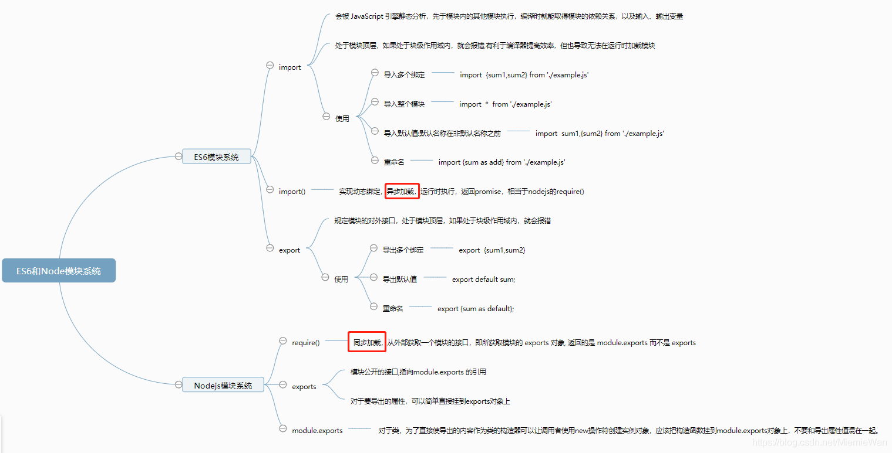

# 一、区分
    1. import命令会被 JavaScript 引擎静态分析，先于模块内的其他模块执行（叫做”连接“更合适）。
    2. import()函数，完成动态加载，异步加载。import()类似于 Node 的require方法，区别主要是前者import是异步加载，
        后者require是同步加载。  ES6 import()返回一个 Promise 对象。
    3. require是运行时加载模块，只有运行时才知道,同步加载。

    CommonJS 模块输出的是一个值的拷贝，ES6 模块输出的是值的引用。
    CommonJS 模块是运行时加载，ES6 模块是编译时输出接口。
    ES6 模块的设计思想是尽量的静态化，使得编译时就能确定模块的依赖关系，以及输入和输出的变量。数据动态更新。
    CommonJS和AMD模块，都只能在运行时确定这些东西。CommonJS模块输出的是值的缓存，不存在动态更新。比如，CommonJS模块就是对象，输入时必须查找对象属性。
    Node遵循CommonJS规范。

# 二、ES6模块
## 1.基本的导出
    (1) 可以在变量、函数、类定义前加export
    (2) 可以在代码的尾部 export { 变量/函数/类的名称 }

## 2.基本的导入
    (1) 在其它模块内使用import关键字来访问已被导出的功能。
    (2) 导入单个绑定： import { identifier1 } from "./example.js";
    (3) 导入多个绑定： import { identifier1, identifier2 } from "./example.js";
    (4) 导入整个模块： import * as example from "./example.js";

    导入绑定的一个怪异点：外部模块导入的name变量与在example.js模块内部的name变量对比， 
    前者是对于后者的只读引用，会始终反映出后者的变化。

## 3.重命名的导入与导出
    你可能并不想使用从模块中导出的变量、函数或类的原始名称。可以在导入或导出的过程中进行修改。
    (1) export { sum as add }
    (2) import { sum as add } from "./example.js"

## 4.导出默认值
    (1)  export default function(num1, num2) {return num1+num2};
    (2)  export sum default
    (3)  export {sum as default};  //使用重命名的语法导出默认值

## 5.导入默认值
    (1) import sum, { color } from "./example.js";  //默认名称与非默认名称分开，默认名称在非默认名称之前。
    (2) import { default as sum, color } from "example"; //默认的导出default 被重命名为 sum

## 6.绑定的再导出
    也许有时你会想将当前模块已导入的内容重新再导出
    (1) import { sum } from "./example.js";
        export { sum }
    (2) export { sum } from "./example.js";

## 7.无绑定的导入
    有些模块也许没有进行任何导出，相反只是修改全局作用域的对象。对于这些对象的修改会反映到其他模块中。
```js
/* example.js */
// 没有导出与导入的模块
Array.prototype.pushAll = function(items) {
    //items 必须是一个数组
    if (!Array.isArray(items)) {
       throw new TypeError("Argument must be an array.");
    } 
    //使用内置的 push() 与扩展运算符
    return this.push(...items);
};
```
```js
import "./example.js";
let colors = ["red", "green", "blue"];
let items = [];
items.pushAll(colors);
```


# 三、Node.js模块
## 1.Node.js 提供了 exports 和 require 两个对象，
    其中 exports 是模块公开的接口， require 用于从外部获取一个模块的接口，即所获取模块的 exports 对象。
```js
//module.js
var name;
exports.setName = function(thyName) {
  name = thyName;
};
exports.sayHello = function() {
  console.log('Hello ' + name);
};
 
 
//getmodule.js
var myModule = require('./module');
myModule.setName('BYVoid');
myModule.sayHello();
```

## 2.覆盖 exports
    有时候我们只是想把一个对象封装到模块中
```js
//hello.js
function Hello() {
  var name;
  this.setName = function(thyName) {
    name = thyName;
  };
  this.sayHello = function() {
    console.log('Hello ' + name);
  };
};
module.exports = Hello;
 
//gethello.js
var Hello = require('./hello');
hello = new Hello();
hello.setName('BYVoid');
hello.sayHello();
```

    注意，模块接口的唯一变化是使用 module.exports = Hello 代替了 exports.Hello=Hello。
        在外部引用该模块时，其接口对象就是要输出的 Hello 对象本身，而不是原先的exports。
    事实上， exports 本身仅仅是一个普通的空对象，即 {}，它专门用来声明接口，本质上是通过它为模块闭包的内部建立了一个有限的访问接口。
        因为它没有任何特殊的地方，所以可以用其他东西来代替，譬如我们上面例子中的 Hello 对象。

## 3.  exports 和 module.exports 的区别了：
    (1) module.exports 初始值为一个空对象 {}
    (2) exports 是指向的 module.exports 的引用（不要修改指向，因为模块导出的module.exports）
    (3) require() 返回的是 module.exports 而不是 exports
## 使用场景：
    (1) 对于要导出的属性，可以简单直接挂到exports对象上
    (2) 对于类，为了直接使导出的内容作为类的构造器可以让调用者使用new操作符创建实例对象,
        应该把构造函数挂到module.exports对象上，不要和导出属性值混在一起。

